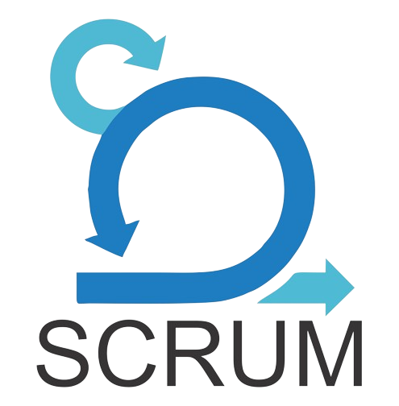

# Portfólio Acadêmico - Felipe Sobral

| Índice das APIs                    |
|-----------------------------------|
| [Projeto Acadêmico 1 (API) – 2º Semestre de 2021](#projeto-acadêmico-1-api--2º-semestre-de-2021) |
| [Projeto Acadêmico 2 (API) – 1º Semestre de 2022](#projeto-acadêmico-2-api--1º-semestre-de-2022) |
| [Projeto Acadêmico 3 (API) – 2º Semestre de 2022](#projeto-acadêmico-3-api--2º-semestre-de-2022) |
| [Projeto Acadêmico 4 (API) – 1º Semestre de 2023](#projeto-acadêmico-4-api--1º-semestre-de-2023) |
| [Projeto Acadêmico 5 (API) – 1º Semestre de 2024](#projeto-acadêmico-5-api--1º-semestre-de-2024) |
| [Projeto Acadêmico 6 (API) – 2º Semestre de 2024](#projeto-acadêmico-6-api--2º-semestre-de-2024) |

 

Introdução

### Sobre o desenvolvedor

  
  <h3 align="center"> Acesse meu portfólio ou rede profissional:</h3>
              
  

    
                                                      
      
      
    

  

  
Sou estudante do 6º semestre de Tecnologia em Banco de Dados na FATEC São José dos Campos, onde tive a oportunidade de aplicar conhecimentos acadêmicos em projetos práticos voltados ao mercado. Através da metodologia de Aprendizado por Projetos Integradores (API), desenvolvi soluções reais para empresas parceiras, aprimorando minhas habilidades técnicas em Python, Java, JavaScript/TypeScript e PL/SQL (Oracle, SQL Server, PostgreSQL e MySQL), além de fortalecer minha experiência em metodologias ágeis, como SCRUM, assim como em práticas de DevOps.

Essas experiências me prepararam para enfrentar desafios do mercado de tecnologia, onde a capacidade de solucionar problemas e a colaboração em equipe são tão valorizadas quanto o domínio técnico.

 

(<a href="#top">Voltar ao Topo</a>)

  
  
Meus Principais Conhecimentos
 

  ### Meus Principais Conhecimentos
  

  
Python

     
  Desenvolvo em Python desde 2021. Já utilizei a linguagem nos paradigmas procedural e orientado ao objeto. Utilizei o Python tanto para desenvolvimento web, utilizando para isso o microserviço Flask, quanto para análise e tratamento de dados, utilizando o Pandas e Numpy. Em alguns momentos, utilizei o Python também para automatizar processos, como alimentar o banco de dados com uma rotina usando SQLAlchemy para a conexão, e automatizar o processo de baixar uma base de dados disponibilizado em um site através de um script que usa Selenium para simular as ações em um navegador.

Logo, pode-se dizer que em Python eu tenho domínio na criação de scripts para automação de tarefas, análise de dados e desenvolvimento web:
  
  - **Flask** : Experiência na construção de APIs RESTful e aplicações web escaláveis.
    
  - **Pandas** : Habilidade em manipulação, análise e visualização de grandes volumes de dados.
    
  - **NumPy** : Capacidade de realizar operações matemáticas complexas e manipulação de arrays.
    
  - **Data Cleaning** : Competência na limpeza e transformação de dados para garantir análises precisas.
    
  - **Automação** : Proficiência em automatizar processos de coleta e processamento de dados.
    
  - **Visualização de Dados** : Criação de dashboards interativos para facilitar a interpretação de dados. Criação de visualizações gráficas e não-gráficas desses dados.

 
 
   
Java
 
     
    Desenvolvo em Java desde 2022, e durante esse período aprofundei meus conhecimentos tanto em desenvolvimento de aplicações web quanto de aplicações desktop. Utilizei o framework Spring Boot para desenvolvimento de back-end, integrando-o ao Hibernate e ao Spring Security para gerenciar a persistência e segurança de dados. Além disso, usei JavaFX para criar interfaces gráficas em aplicações desktop, aplicando conceitos de event handling e bindings para otimizar a interação com o usuário.

  - **Spring Boot:** Desenvolvimento de APIs RESTful escaláveis e sistemas seguros utilizando práticas avançadas de desenvolvimento, como injeção de dependências, configuração automática e padrões de design.
    
  - **Hibernate (JPA):** Capacidade de gerenciar a persistência de dados em bancos relacionais, utilizando mapeamento objeto-relacional e criação de consultas otimizadas.
    
  - **Spring Security:** Implementação de segurança em aplicações web, utilizando autenticação JWT e controle de acesso com base em funções de usuário.
    
  - **JavaFX:** Desenvolvimento de interfaces gráficas, incluindo a criação de componentes visuais personalizados e gestão de eventos.

 

 
  
PL/SQL
 
    
  Tenho experiência com PL/SQL desde 2022, trabalhando com comandos DDL, DCL e DML. Além disso, realizei modelagem de dados nos níveis Conceitual, Lógico e Físico, criando bases de dados robustas para diferentes projetos. Minha experiência inclui trabalhar com Oracle, SQL Server, PostgreSQL, e MySQL, garantindo que a estrutura do banco de dados e as regras de negócio sejam mantidas com consistência.

  - **Manipulação de Dados:** Criação e gerenciamento de tabelas, constraints e índices para otimização da performance e integridade dos dados.
    
  - **Stored Procedures e Triggers:** Desenvolvimento de procedimentos armazenados para automação de processos de banco de dados e implementação de triggers para garantir regras de negócio.
    
  - **Consultas Otimizadas:** Criação de consultas complexas e estratégias de indexação para manipular grandes volumes de dados e melhorar o tempo de resposta.

 

 
  
JavaScript e TypeScript
 
    
  Trabalho com JavaScript desde 2022, e utilizo TypeScript para adicionar tipagem e melhorar a qualidade do código. Minha experiência se concentra no desenvolvimento de interfaces de usuário utilizando frameworks modernos, como Vue.js e React.js, além de criar backends escaláveis utilizando o NestJS.

 - **Vue e React:** Desenvolvimento de interfaces de usuário reativas, utilizando componentes dinâmicos, directives e mixins para simplificação e reaproveitamento de código.
   
 - **TypeScript:** Tipagem estática para garantir segurança e robustez no desenvolvimento de aplicativos web, facilitando a detecção de erros em tempo de desenvolvimento.
    
 - **NestJS:** Desenvolvimento de APIs escaláveis e estruturadas, utilizando injeção de dependências e modularização para garantir uma organização clara do projeto.
    
 - **DOM Manipulation:** Conhecimento profundo do funcionamento do DOM e manipulação direta para construir interações dinâmicas com a interface.

 

 
  
SCRUM
 
    
  Tenho contato com o SCRUM desde 2021, e desde então participei de vários projetos acadêmicos que adotaram essa metodologia ágil. Assumi diferentes funções na equipe, como Scrum Master, onde organizei e orientei a equipe, e Product Owner (PO), onde fui responsável por priorizar as funcionalidades e alinhar as entregas com as necessidades do cliente.

  - **Scrum Master:** Experiência em coordenar equipes e remover impedimentos, garantindo a produtividade e a eficiência do projeto.
    
  - **Product Owner:** Habilidade de gerenciar o backlog do produto e garantir que as expectativas do cliente sejam atendidas em cada entrega.

 
  
DevOps e Práticas de Desenvolvimento
 
    
  Tenho experiência prática em DevOps, adquirida ao longo de diversos projetos em que implementei e mantive processos e pipelines de CI/CD, conteinerização de aplicações, análise de qualidade de código e automação de deploys. Utilizo uma combinação de ferramentas e práticas para garantir a rastreabilidade, qualidade e eficiência no ciclo de desenvolvimento de software.

  - **Docker e Docker Compose:** Conhecimento aprofundado em Docker para criar containers de aplicações e suas dependências, garantindo portabilidade e consistência entre ambientes de desenvolvimento, teste e produção. Utilizo o Docker Compose para orquestrar e gerenciar múltiplos serviços de forma integrada, configurando volumes, redes e dependências de inicialização.

  - **Testes de Unidade e Integração:** Desenvolvo testes de unidade utilizando diversos frameworks de diferentes linguagens de programação para garantir a qualidade isolada dos componentes no frontend e das camadas no backend. Nos testes de integração, busco simular cenários complexos e validar a interação entre os módulos do sistema.

  - **Análise Estática de Código com SonarQube:** Configuro o SonarQube para realizar análises de qualidade de código, identificando bugs, vulnerabilidades de segurança e melhorias potenciais. Personalizo regras de análise e acompanho métricas como cobertura de código, complexity e duplicidade, além de integrar a análise do Sonar à pipelines de CI/CD, garantindo a análise constante para evitar regressões, bugs e outras ocorrências indesejadas.

 - **Automação de Pipelines de CI/CD com GitHub Actions:** Crio pipelines automatizadas utilizando GitHub Actions, incluindo tarefas de build, execução de testes, verificação de qualidade de código, deploy automático e monitoramento de falhas. Busca criar gatilhos automáticos em eventos de push e pull_request, garantindo um ciclo de desenvolvimento seguro e contínuo.

- **Versionamento e Rastreamento com Git e GitHub:** Experiência no uso avançado do Git para controle de versão, gerenciamento de branches e realização de merges complexos. No GitHub, utilizo recursos como pull requests, GitHub Issues e GitHub Projects para organizar e rastrear o progresso do projeto de forma colaborativa.

- **Documentação Técnica e Boas Práticas:** Preocupação constante com a criação de documentações claras e extensivas, utilizando a Wiki do GitHub para registrar configurações, práticas de DevOps e fluxos de trabalho críticos. Criação de orientações e guidelines para garantir um entendimento completo e padronizado das práticas e ferramentas utilizadas por toda a equipe.

  
<h4>Skill Set Completo</h4>

  
  ### <h3 align="center">Meu Skill Set</h3>
  
      
   <table align="center">
    <thead>
        <tr>
            <th></th>
            <th>Tecnologia</th>
            <th>Experiência</th>
        </tr>
    </thead>
    <tbody>
        <tr>
            <td align="center"></td>
            <td><em>Java</em></td>
            <td>Avançado</td>
        </tr>
        <tr>
            <td align="center"></td>
            <td><em>SpringBoot</em></td>
            <td>Avançado</td>
        </tr>
        <tr>
              <td align="center">
                

                  
                  

              </td>
              <td><em>JPA e Hibernate</em></td>
              <td>Avançado</td>
        </tr>
        <tr>
              <td align="center"></td>
              <td><em>SpringBoot Security</em></td>
              <td>Avançado</td>
        </tr>
        <tr>
              <td align="center">
                

                  
                  
                  
              </td>
              <td><em>SQL e PL/SQL</em></td>
              <td>Avançado</td>
        </tr>
        <tr>
              <td align="center"></td>
              <td><em>JUnit5</em></td>
              <td>Intermediário</td>
        </tr>
        <tr>
              <td align="center"></td>
              <td><em>Mockito</em></td>
              <td>Intermediário</td>
        </tr>
        <tr>
              <td align="center">
                

                  
                  
                
  
              </td> 
              <td><em>Git e Github</em></td>
              <td>Avançado</td>
        </tr>
        <tr>
              <td align="center"></td>
              <td><em>Metodologia Ágil Scrum</em></td>
              <td>Avançado</td>
        </tr>  
        <tr>
              <td align="center"></td>
              <td><em>Docker</em></td>
              <td>Intermediário</td>
        </tr>  
        <tr>
              <td align="center"></td>
              <td><em>Docker Compose</em></td>
              <td>Intermediário</td>
        </tr> 
        <tr>
              <td align="center"></td>
              <td><em>Apache Kafka</em></td>
              <td>Intermediário</td>
        </tr>  
        <tr>
              <td align="center"></td>
              <td><em>JavaScript</em></td>
              <td>Avançado</td>
        </tr>  
        <tr>
              <td align="center"></td>
              <td><em>TypeScript</em></td>
              <td>Avançado</td>
        </tr>
        <tr>
              <td align="center"></td>
              <td><em>Vue.js</em></td>
              <td>Avançado</td>
        </tr>
        <tr>
              <td align="center"></td>
              <td><em>React.js</em></td>
              <td>Intermediário</td>
        </tr>
        <tr>
              <td align="center"></td>
              <td><em>CSS3</em></td>
              <td>Avançado</td>
        </tr>
        <tr>
              <td align="center"></td>
              <td><em>HTML5</em></td>
              <td>Avançado</td>
        </tr>  
        <tr>
              <td align="center"></td>
              <td><em>JavaFx</em></td>
              <td>Intermediário</td>
        </tr>  
        <tr>
              <td align="center"></td>
              <td><em>Python</em></td>
              <td>Avançado</td>
        </tr>  
        <tr>
              <td align="center"></td>
              <td><em>Flask</em></td>
              <td>Avançado</td>
        </tr>  
        <tr>
              <td align="center"></td>
              <td><em>Pandas</em></td>
              <td>Avançado</td>
        </tr>  
        <tr>
              <td align="center"></td>
              <td><em>SQLAlchemy</em></td>
              <td>Avançado</td>
        </tr>   
        <tr>
              <td align="center"></td>
              <td><em>Selenium</em></td>
              <td>Intermediário</td>
        </tr>   
    

    </tbody>
  </table>   
  

            

 

# Projeto Acadêmico 1 (API) – 2º Semestre de 2021

- **Parceiro Aacadêmico:** Própria FATEC

- **Projeto de Monitoramento e Análise de Dados da COVID-19:** Este projeto foi desenvolvido em parceria com os docentes da faculdade ocupando o papel de clientes, com o objetivo de criar uma ferramenta robusta para monitoramento em tempo real dos dados relacionados à pandemia de COVID-19 no estado de São Paulo. A ferramenta abrange a coleta, processamento e visualização de dados, permitindo uma análise detalhada e contínua da evolução da pandemia.
 

Visão do Projeto

  

  

  

 
- O problema central abordado pelo projeto foi a necessidade de monitoramento contínuo e preciso da pandemia de COVID-19. Com a grande quantidade de dados gerados diariamente, havia uma dificuldade em consolidar essas informações de forma acessível e útil para o cliente, que tinha um interesse por acompanhar o avanço da pandemia em nosso Estado.
  
- A solução entregue foi uma aplicação web que coleta, processa e visualiza dados da COVID-19 em tempo real. Utilizando tecnologias como Flask, Pandas e diversas bibliotecas Python, a aplicação oferece dashboards interativos que mostram a evolução dos casos, óbitos, vacinação, ocupação de leitos e índices de isolamento social. Além disso, foram implementadas funcionalidades de filtragem de dados por data e município, proporcionando uma análise detalhada e customizada.

[Repositório do Projeto](https://github.com/SoSoJigsaw/Carcara)

Funcionalidades

  
- **Páginas Informativas:** O sistema fornecia informações detalhadas sobre casos e óbitos, taxa de vacinação e leitos disponíveis, oferecendo esses dados de maneira acessível e direta aos usuários.
  
- **Filtragem de Dados:** Foi implementada uma variedade de filtros que permitem aos usuários selecionar estados e municípios por data, possibilitando a obtenção de insights valiosos sobre a pandemia.
  
- **Painéis Totalizadores:** O sistema incluía uma aba com painéis totalizadores, apresentando informações relevantes sobre o andamento da pandemia de forma consolidada. 

Tecnologias adotadas na solução

  
- **Python**: Fundamental para o desenvolvimento dos scripts de coleta e processamento de dados. A linguagem foi escolhida por sua simplicidade e poderosas bibliotecas para análise de dados.
  
- **Selenium**: Utilizado para automações de requests persistentes, onde era necessário fazer o download através de uma requisição web diariamente para atualizar com os dados mais atuais da pandemia. Como o dataset utilizado não dispunha de uma API, havia essa necessidade de reproduzir comandos humanos em um navegador, para assim poder baixar os dados atualizados pela identificação de certos elementos imutáveis na página.
  
- **Flask**: Utilizado para construir a API e o backend da aplicação web. Flask foi escolhido devido à sua flexibilidade e capacidade de criar aplicações web escaláveis.
  
- **Pandas**: Essencial para a manipulação e análise dos dados coletados. Pandas permitiu a transformação e limpeza dos dados de forma eficiente.
  
- **NumPy**: Utilizado para operações matemáticas e manipulação de arrays, complementando as funcionalidades do Pandas.

Contribuições Individuais

 
  
Minhas principais contribuições para o projeto incluíram:

- **Desenvolvimento de Scripts de Coleta de Dados**:
  Fui responsável por desenvolver scripts automatizados que coletam dados de diversas fontes, como arquivos CSV armazenados localmente e dados disponibilizados online. Utilizando a biblioteca `glob`, automatizei a identificação e leitura dos arquivos mais recentes, garantindo que a aplicação sempre tivesse acesso aos dados mais atualizados.

- **Processamento e Limpeza de Dados**:
  Utilizei `Pandas` para realizar operações de limpeza e transformação dos dados. Isso incluiu a remoção de duplicatas, tratamento de valores ausentes e padronização de formatos de data. A limpeza de dados é crucial para garantir a precisão das análises, e consegui implementar uma pipeline eficiente que trata grandes volumes de dados de forma rápida e precisa.

- **Desenvolvimento da Aplicação Flask**:
  No backend, utilizei o `Flask` para criar uma API RESTful que serve os dados processados para a interface web. Implementei rotas que permitem a consulta de dados filtrados por data e município, e configurei o servidor para suportar múltiplas requisições simultâneas, garantindo a escalabilidade da aplicação.

- **Visualização de Dados**:
  Criei dashboards interativos utilizando bibliotecas como `Matplotlib` e `Plotly`, que permitiram visualizar a evolução dos casos, óbitos, vacinação, ocupação de leitos e índices de isolamento social. As visualizações são atualizadas em tempo real, proporcionando uma ferramenta poderosa para a tomada de decisões informadas.

- **Integração de Múltiplas Fontes de Dados**:
  Combinei dados de diferentes fontes para criar um banco de dados unificado e coerente. Isso envolveu a junção de dataframes, o tratamento de colunas inconsistentes e a agregação de informações complementares. A integração de dados foi fundamental para fornecer uma visão holística da situação da pandemia.

Aprendizados Efetivos

 
  
  
  
Hard Skills

 

| Hard Skills           | Descrição                                                                                           |
|-----------------------|-----------------------------------------------------------------------------------------------------|
| **Python**            | Desenvolvimento avançado de scripts e aplicações, especialmente para automação de tarefas e análise de dados. |
| **Pandas**            | Proficiência em operações complexas de limpeza e transformação de dados, manipulação de grandes datasets e geração de análises precisas. |
| **Flask**             | Desenvolvimento de APIs RESTful e backend de aplicações web, incluindo configuração de servidor e gerenciamento de rotas. |
| **NumPy**             | Realização de cálculos matemáticos avançados e manipulação de arrays multidimensionais.               |
| **Data Cleaning**     | Habilidade de identificar e corrigir problemas nos dados, garantindo a integridade e a qualidade das análises. |
| **Visualização de Dados** | Criação de gráficos e dashboards interativos que facilitam a interpretação de grandes volumes de dados. |
  

  

  
Soft Skills

  
    
| Soft Skills           | Descrição                                                                                           |
|-----------------------|-----------------------------------------------------------------------------------------------------|
| **Comunicação Assertiva**        | Durante o projeto, a comunicação foi essencial para alinhar as expectativas com a equipe. Participei ativamente de reuniões semanais, apresentando o progresso e discutindo desafios técnicos. Minha habilidade de comunicar ideias complexas de maneira clara foi fundamental para o sucesso do projeto. |
| **Gerenciamento de Tempo** | Trabalhei com prazos apertados e múltiplas tarefas simultâneas. Utilizei técnicas de gerenciamento de tempo, como a priorização de tarefas e o uso de listas de verificação, para garantir que todas as entregas fossem concluídas dentro dos prazos estabelecidos. |
| **Pensamento Analítico** | A análise detalhada dos dados foi crucial para identificar padrões e tendências na evolução da pandemia. Utilizei minhas habilidades analíticas para interpretar os dados de forma crítica, proporcionando insights valiosos para a tomada de decisões. |
| **Resiliência**           | Trabalhei com prazos curtos e dados inconsistentes, superando obstáculos para entregar soluções viáveis. |
| **Autonomia**             | Executei grande parte do projeto de forma independente, tomando decisões por conta própria.       |
  

 

# Projeto Acadêmico 2 (API) – 1º Semestre de 2022

- **Parceiro Acadêmico:** Dom Rock

  

Projeto realizado em parceria com a Dom Rock, uma empresa especializada em soluções de Big Data e Inteligência Artificial.
 

Visão do Projeto

 

  

  
- O objetivo foi desenvolver uma API robusta e eficiente para a gestão e análise de dados, que fosse capaz de suportar grandes volumes de informações e múltiplos usuários simultaneamente.
  
- O projeto consistiu na criação de uma API para integração, processamento e gerenciamento de dados provenientes de diversas fontes. A API foi projetada com foco em escalabilidade, segurança e performance, permitindo a geração de relatórios e análises avançadas para suportar a tomada de decisão dos clientes da Dom Rock.

[Repositório do Projeto](https://github.com/fluffyfatec/Dom_Rock)

Funcionalidades

  
- **Gestão de Clientes:** O sistema permite registrar todas as informações dos clientes, incluindo detalhes de contato e endereço. Isso facilita a administração do relacionamento com o cliente, oferecendo uma visão consolidada e de fácil acesso.
  
- **Catalogação de Soluções:** Há uma base de dados que mantém um catálogo detalhado das soluções e módulos oferecidos pela Dom Rock, destacando funcionalidades e versões disponíveis. Isso proporciona uma referência rápida e precisa sobre os produtos da empresa, tanto para a equipe interna quanto para os clientes.
  
- **Processo de Ativação:** O sistema define e gerencia o processo de ativação, dividindo-o em etapas específicas, cada uma com recursos e definições predefinidos. Isso garante uma ativação organizada e registra o progresso para uma visão clara do status de cada cliente.
  
- **Relatórios e Consultas:** As funcionalidades de consulta e relatórios oferecem uma análise detalhada dos dados, permitindo aos usuários visualizar métricas importantes, como desempenho por cliente, tipo de solução ativada e estágio do processo de ativação. Esses insights ajudam nas decisões estratégicas, proporcionando uma compreensão completa do ambiente operacional. 

Tecnologias adotadas na solução

- **Java:** Escolhida pela sua robustez, portabilidade e vasto ecossistema de bibliotecas e frameworks, facilitando o desenvolvimento de aplicações escaláveis e de alta performance.
  
- **Spring Boot:** Framework que simplifica o desenvolvimento de aplicações Java, oferecendo configuração automática, suporte a segurança, e fácil gerenciamento de dependências.
  
- **JavaFX:** Utilizado para a criação de interfaces gráficas, proporcionando uma experiência de usuário rica e interativa.
  
- **PL/SQL:** Utilizado para a manipulação e gestão dos dados no banco de dados, garantindo eficiência nas operações e integridade dos dados.
  
- **SCRUM:** Metodologia ágil adotada para gerenciar o projeto de forma iterativa e incremental, promovendo a colaboração e a adaptabilidade da equipe.

Contribuições Individuais

 

Durante o desenvolvimento deste projeto, minhas contribuições foram diversas e abrangentes, focando em assegurar a entrega de uma solução técnica sólida e funcional.

Desenvolvimento do Back-end

### Desenvolvimento do Back-end
- **Criação de Serviços RESTful:** Utilizei Java e Spring Boot para desenvolver uma série de serviços RESTful. Esses serviços foram responsáveis por manipular e integrar dados provenientes de diversas fontes, garantindo escalabilidade e alta performance. Implementações específicas incluíram endpoints para criação, leitura, atualização e exclusão de dados (CRUD), bem como serviços para autenticação e autorização de usuários.
  
- **Implementação de Segurança:** Integrei o Spring Security para implementar medidas robustas de segurança na API. Isso incluiu a configuração de autenticação baseada em tokens JWT (JSON Web Tokens), controle de acesso baseado em roles (papéis) de usuário, e proteção contra ataques comuns como CSRF (Cross- Site Request Forgery).

Integração com Banco de Dados

### Integração com Banco de Dados  
- **Modelagem de Dados:** Utilizando PL/SQL, fui responsável por modelar o banco de dados, criando tabelas, views, stored procedures e triggers. A modelagem foi projetada para otimizar o desempenho das consultas e garantir a integridade referencial dos dados.
  
- **Consultas Eficientes:** Escrevi queries complexas e otimizadas para suportar grandes volumes de dados. Utilizei técnicas como índices, joins eficientes e subconsultas para melhorar a performance das operações de leitura e escrita no banco de dados.

Desenvolvimento de Interfaces Gráficas

### Desenvolvimento de Interfaces Gráficas
- **Interfaces com JavaFX:** Desenvolvi interfaces gráficas utilizando JavaFX, permitindo uma interação intuitiva e responsiva com a aplicação. As interfaces incluíam dashboards para visualização de dados, formulários para entrada de informações, e componentes visuais para a navegação na aplicação.

Gestão de Equipe e Metodologias Ágeis

### Gestão de Equipe e Metodologias Ágeis
- **Product Owner:** Assumi o papel de Product Owner, criando e priorizando o backlog do produto em alinhamento com os requisitos do parceiro acadêmico. Isso envolveu a definição de histórias de usuário, critérios de aceitação e a comunicação constante com os stakeholders para garantir que as entregas atendiam às expectativas.

Aprendizados Efetivos

 

Hard Skills

 
  
| Hard Skills           | Descrição                                                                                           |
|-----------------------|-----------------------------------------------------------------------------------------------------|
| **Java**              | Aprimorei minhas habilidades em Java, focando em práticas avançadas de programação, como a utilização de padrões de design (Design Patterns) para assegurar um código limpo e sustentável. |
| **PL/SQL**            | Aprofundei meus conhecimentos em PL/SQL, escrevendo scripts complexos para manipulação de dados e otimização de consultas. |
| **JavaFX**            | Desenvolvi interfaces gráficas avançadas, utilizando bindings, event handling e customização de componentes visuais para melhorar a experiência do usuário. |

Soft Skills

 

| Soft Skills           | Descrição                                                                                           |
|-----------------------|-----------------------------------------------------------------------------------------------------|
| **Trabalho em Equipe** | Fomentei um ambiente de colaboração, trabalhando efetivamente com colegas de equipe para superar desafios técnicos e cumprir prazos. |
| **Liderança Técnica**             | Coordenei discussões técnicas e orientei a equipe sobre soluções envolvendo integração de sistemas.   |
| **Negociação e Alinhamento**      | Alinhei expectativas e negociei ajustes nos requisitos do projeto, mantendo o progresso sem atritos. |
| **Colaboração**                   | Trabalhei em estreita colaboração com a equipe, contribuindo para revisões de código e conhecimento compartilhado. |

 

# Projeto Acadêmico 3 (API) – 2º Semestre de 2022

- **Parceiro Acadêmico:** IACIT

  

Projeto feito com a parceria da IACIT, uma empresa de São José dos Campos que presta consultoria meteorológica, sendo que um de seus serviços atuais é fornecer aos clientes relatórios customizados de dados meteorológicos.

Visão do projeto

 

  

  
Como a empresa trabalhava processando muitas informações manualmente, ela acabava por perder tempo, desperdiçando recursos com esse processo. Por isso, a empresa precisava da criação de um sistema que permitisse realizar a importação dos dados meteorológicos, bem como armazená- los em uma base de dados, para posteriormente gerar os relatórios desejados por seus clientes.

Dessa forma, o projeto visava desenvolver uma aplicação web para a empresa que possibilite a automatização desde o download, o processamento dos dados e a persistência dos dados no banco de dados de forma simplificada. Além disso, a aplicação aspirava possibilitar realizar a filtragem desses dados por temperatura, umidade, estações, vento, pressão atmosférica, radiação global e precipitação, além de possibilitar diversas visualizações desses dados. Por fim, a aplicação objetivava a criação de diferentes níveis de usuários juntamente com o painel administrativo, possibilitando a exportação dos relatórios a partir dos dados.

[Repositório do Projeto](https://github.com/fluffyfatec/Iacit)

Funcionalidades

  
- **Cadastro de Estados e Regiões:** O cadastro de Estados e Regiões proporciona uma organização precisa das operações, permitindo análises específicas por região e melhorando significativamente a contextualização das informações.
  
- **Geração de Relatórios:** A geração de relatórios é uma ferramenta indispensável para extrair insights valiosos e avaliar o desempenho do sistema. A capacidade de criar relatórios personalizados permite uma visualização abrangente dos dados, oferecendo detalhes sobre o estado das estações, o desempenho regional e as tendências temporais.
  
- **Importação de Dados:** A importação de dados otimiza o fluxo de informações no sistema, facilitando a transferência rápida de grandes conjuntos de dados. Isso assegura uma atualização eficiente do sistema, mantendo-o sempre atualizado e pronto para fornecer análises precisas. 

Tecnologias adotadas na solução

- **HTML5 / CSS3 / Javascript (EC6)** : O front- end da aplicação foi desenvolvida em HTML para marcação de hipertexto, CSS3 para estilização da página, e Javascript (EC6) para utilização do AJAX, permitindo assim enviar e receber dados assincronamente do servidor web e evitar o recarregamento da página inteira sem a necessidade de uma nova solicitação, também para criar paginação personalizada, utilizar jsPDF para a geração de PDFs dos gráficos, e enviar variáveis ao servidor por requisições GET através da url da página.
  
- **Spring Boot** : O back-end da aplicação web foi realizada através do Spring Boot, onde foi definida toda a estrutura do projeto do lado servidor, criando para isso os packages controller, dto, modal, report, repository e service. Os controllers foram criados para gerenciar os endpoints e definir suas lógicas, o dto e o modal foram criados para mapear as entidades do banco de dados na aplicação, o report foi para definir classes que contém a lógica de criação dos PDFs que posteriormente seriam acessados em determinados endpoints dos controllers, o repository foi usado para criar interfaces que estendem o JpaRepository para declarar querys que serão utilizadas na lógica dos controllers, e o service foi usado para conter classes que encapsulam a lógica de negócios da aplicação e para expor serviços que podem ser acessados pelos controllers, como as ações de deletar e atualizar usuário ou a validação do login por um usuário.
  
- **Python** : O Python foi utilizado para analisar e tratar os dados meteorológicos que seriam utilizados na aplicação, e também para a criação de script de automação do povoamento do banco de dados por esses mesmos dados. Os dados precisaram primeiro serem tratados pelo Pandas para posteriormente serem analisados pela mesma biblioteca, e a criação do script de automação do povoamento foi realizado com o uso da biblioteca SQLAlchemy, que permitiu a utilização de comandos SQL dentro do Python, automatizando o processo de inserts à medida que os dados eram tratados. Foi utilizado o paradigma da orientação ao objeto nesse script, o que reduziu a reutilização de código e permitiu o processamento progressivo de toda a lógica do script ao permitir o acesso de uma classe às demais classes.
  
- **PostgreSQL** : O PostgreSQL foi o SGBD escolhido para a criação do banco de dados exigido no projeto. Através dele, foi feita toda a modelagem e administração do banco, que foi responsável por armazenar todos os dados meteorológicos que foram utilizados para o dashboard da aplicação e para o CRUD de usuários. Além da criação das tabelas e constraints, e inserts realizados, a aplicação necessitou do uso de views que limitavam o acesso aos dados pelo usuário final, triggers para permitir a criação de uma tabela de auditoria que faz um controle de todas as modificações realizadas por um usuário nas tabelas de interesse, e a criação de índices para as tabelas para melhorar o desempenho de consultas, redução de tempo de resposta, otimização da utilização de memória e, por fim, trazer melhorias em operações de junção, que foram muito utilizadas no projeto.

Contribuições Individuais

 

Script de Automação do povoamento do banco

### Script de Automação do povoamento do banco
- Fui o responsável pela criação de um script em Python que recebia os dados meteorológicos de uma base de dados disponibilizado em um servidor web através de um request, toda vez que o script era executado ele fazia o request e verificava se havia novos dados para serem baixados. Se houvesse novos dados, ele os baixava para um diretório reservado do projeto.
  
- O script acessava em loop todos os dados baixados no diretório e fazia o tratamento deles utilizando Pandas, mudando seus tipos e formatação de forma que depois de tratados estivessem em um formato adequado à lógica das tabelas do banco de dados criado.
  
- Assim que terminava o tratamento desses dados, os dataframes eram enviados à outro método que fazia a rotina de enviar esses dados ao banco de dados, fazendo inserts nas tabelas devidas, usando para isso o SQLAlchemy para criar a conexão com o banco e utilizar comandos de SQL puro dentro do Python. Essa rotina incluía tratamento de erros, evitando a duplicação de dados no banco, redundância, e quebra de constraints de chave primária. O script foi otimizado, permitindo que a tentativa de envio de dados ao banco, ou seja, a execução do comando SQL, só acontecesse caso o dataframe trouxesse novos dados.

[Veja mais detalhes](https://github.com/SoSoJigsaw/Portfolio/blob/main/Detalhes%20das%20Contribui%C3%A7%C3%B5es/ScriptDeAutomacao.md)

Geração de Relatórios

  
### Geração de Relatórios
Fui responsável pela implementação de relatórios meteorológicos automatizados em formato PDF. Desenvolvi uma classe específica para cada variável meteorológica, utilizando a biblioteca `iText` para geração dos PDFs. As principais funcionalidades incluíam:

- Geração de tabelas dinâmicas com dados meteorológicos, exibindo data/hora e as respectivas variáveis para cada registro.
  
- Estilização e formatação avançada dos relatórios, incluindo cabeçalhos personalizados, imagens (logotipo da IACIT) e layout responsivo para múltiplas páginas.
  
- Exportação de PDFs através da API REST Spring Boot, permitindo que os usuários baixassem relatórios diretamente pela aplicação web.
  
- Implementação de métodos otimizados para consulta e processamento dos dados meteorológicos, garantindo a eficiência na geração dos relatórios mesmo com grandes volumes de dados.

Essa contribuição resultou em um processo automatizado de geração de relatórios que otimizou a coleta e visualização dos dados meteorológicos, melhorando a experiência do usuário na análise dos dados fornecidos pela aplicação.

[Veja mais detalhes](https://github.com/SoSoJigsaw/Portfolio/blob/main/Detalhes%20das%20Contribui%C3%A7%C3%B5es/RelatoriosPDF.md)

Geração de PDFs dos gráficos

### Geração de PDFs dos gráficos
No front-end, eu ajudei em partes da estilização das páginas. No entanto, fui responsável também por criar o método que gerava o PDF dos gráficos. Para isso:

- eu usei uma biblioteca do JavaScript chamada jsPDF, que estilizou o PDF e incluiu o gráfico nele, gráfico esse que foi convertido de elemento canvas HTML em um arquivo de imagem PNG e possibilitou dentro do mesmo método o download em PDF

[Veja mais detalhes](https://github.com/SoSoJigsaw/Portfolio/blob/main/Detalhes%20das%20Contribui%C3%A7%C3%B5es/PDFsGraficos.md)

Aprendizados Efetivos

 

Hard Skills

 

| Hard Skills                                      | Descrição                                                                                           |
|--------------------------------------------------|-----------------------------------------------------------------------------------------------------|
| **Interação e persistência de dados com o banco de dados** | Desenvolvi habilidades na escrita de código para interagir com banco de dados, considerando questões de segurança, integridade de dados e boas práticas, como o uso de transações e validação de dados. Utilizei a biblioteca SQLAlchemy no Python para realizar essas operações. |
| **Paradigma da Programação Orientada a Objetos (POO) em Python** | Ganhei autonomia no uso de POO em Python, aplicando conceitos como encapsulamento, herança e polimorfismo. Reduzi redundâncias no código utilizando a reusabilidade de métodos e parâmetros. |
| **Manipulação de arquivos e requisições no Python** | Dominei a manipulação de arquivos e diretórios no Python com os módulos "os", "zipfile", "shutil", e utilizei o "requests" para fazer requisições HTTP. Manipulei dados em formato CSV com o "pandas". |
| **Geração de logs e tratamento de exceções em Python** | Adquiri autonomia para gerar logs e tratar exceções em Python, utilizando `try`, `except` e `raise` para melhorar a depuração e o controle de erros no código. |
| **Aprimoramento no tratamento e análise de dados usando Pandas** | Aperfeiçoei habilidades em manipulação e transformação de dados com Pandas, realizando tarefas como renomeação de colunas, tratamento de valores nulos e conversão de tipos de dados. |
| **Manipulação de PDFs através do Java**          | Desenvolvi habilidades na criação e manipulação de PDFs com Java, utilizando loops e listas de objetos para povoar documentos com dados variáveis. |
| **Utilização da arquitetura MVC no SpringBoot**  | Aprendi a criar métodos de requisição no Controller do Spring, utilizando anotações como `@GetMapping` e `@PathVariable`, e construí respostas HTTP com `ResponseEntity`. |
| **Manipulação de PDFs com JavaScript e HTML canvas** | Criei e manipulei PDFs com JavaScript, convertendo elementos HTML canvas em PNG e inserindo-os nos documentos gerados. |

Soft Skills

 
  
| Soft Skills                        | Descrição                                                                                           |
|------------------------------------|-----------------------------------------------------------------------------------------------------|
| **Organização e Priorização**      | Organizei tarefas críticas para garantir a conclusão do projeto dentro do prazo estipulado.          |
| **Proatividade**                   | Identifiquei melhorias e tomei a iniciativa de implementá-las, otimizando processos e scripts.       |
| **Autogestão**                     | Gerenciei minhas próprias responsabilidades e prazos, entregando soluções sem necessidade de supervisão constante. |
| **Atenção aos Detalhes**           | Garanti a integridade dos dados processados, identificando possíveis inconsistências durante a automação. |

 

# Projeto Acadêmico 4 (API) – 1º Semestre de 2023

- **Parceiro Acadêmico:** Embraer

  

Projeto realizado em parceria com a Embraer, uma empresa especializada em soluções de aeronáutica, defesa e segurança, proporcionando inovações tecnológicas para o setor aeroespacial.

Visão do Projeto

 

  

- O objetivo foi desenvolver uma aplicação robusta e eficiente para a integração e gerenciamento de dados de aeronaves, contribuindo para a otimização das operações e manutenção.
  
- O projeto consistiu na criação de uma API para integração, processamento e gerenciamento de dados provenientes de sistemas de monitoramento de aeronaves, manutenção e operações. A API foi projetada com foco em escalabilidade, segurança e performance, permitindo a geração de relatórios detalhados e visualização de dados em tempo real.

[Repositório do Projeto](https://github.com/fluffyfatec/Projeto-Integrador-Embraer)

Funcionalidades

  
- **Dashboard Administrativo:** interface dentro da aplicação dedicada e de acesso limitado aos usuários administradores, onde eles podem ter ciência de todos os usuários cadastrados, e também supervisionar todos os acessos à aplicação.
  
- **Diferentes níveis de acesso:** já que a aplicação contava com três níveis de usuário (administrador, editor e piloto), foi criado um sistema robusto de autorização e autenticação com o auxílio de JWT Authentication e Spring Security.
  
- **Cadastro de itens:** métodos CRUD para registrar condições para cada item dos chassis.
  
- **Acesso aos dados de formas gráficas:** para análise dos dados em geral e do perfil dos usuários e chassis, a aplicação conta também com uma interface para gráficos de acesso restrito dos administradores, o que possibilita aos mesmos criarem insights a respeito dos dados de uso recolhidos.
  
- **Relatórios:** a aplicação permite a exportação de relatórios personalizáveis, com capacidade de serem filtrados com apenas os parâmetros relevantes ao usuário.
  
- **Notificações:** foi adicionada à aplicação uma funcionalidade de gerar e enviar notificações aos usuários, mediante a uma alteração em um Boletim de Serviço no qual o usuário tenha relação (ou seja, ele é um proprietário do chassi em questão, ou ele é um usuário administrador pertencente à equipe da Embraer).

Tecnologias adotadas na solução

- **Vue.js:** Escolhido para a construção das interfaces de usuário devido à sua reatividade e facilidade de integração com outras bibliotecas, além de sua simplicidade e eficiência na criação de interfaces reativas e componentes reutilizáveis.
  
- **TypeScript:** Utilizado para adicionar tipagem estática ao JavaScript, melhorando a qualidade do código e facilitando a manutenção.
  
- **Pinia:** Gerenciador de estado escolhido por sua simplicidade e integração com Vue.js.
  
- **Vite:** Ferramenta de build moderna e rápida, utilizada para otimizar o desenvolvimento e a construção do projeto.
  
- **Axios:** Biblioteca para realizar requisições HTTP, essencial para comunicação entre o frontend e backend.
  
- **Spring Boot:** Framework utilizado para o desenvolvimento do backend devido à sua robustez e suporte para a criação de APIs RESTful.
  
- **SCRUM:** Metodologia ágil adotada para gerenciar o projeto de forma iterativa e incremental, promovendo a colaboração e a adaptabilidade da equipe.

Contribuições Individuais

 

Durante o desenvolvimento deste projeto, minhas contribuições foram diversas e abrangentes, focando em várias áreas críticas do projeto.

Desenvolvimento do Back-end

### Desenvolvimento do Back-end
- **Criação de Serviços RESTful:** Utilizei Spring Boot para desenvolver uma série de serviços RESTful. Esses serviços foram responsáveis por manipular e integrar dados provenientes de diversas fontes, garantindo escalabilidade e alta performance. Implementações específicas incluíram endpoints para criação, leitura, atualização e exclusão de dados (CRUD), bem como serviços para autenticação e autorização de usuários.
  
- **Implementação de Segurança:** Integrei o Spring Security para implementar medidas robustas de segurança na API. Isso incluiu a configuração de autenticação baseada em tokens JWT (JSON Web Tokens), controle de acesso baseado em roles (papéis) de usuário, e proteção contra ataques comuns como CSRF (Cross-Site Request Forgery).
  
- **Spring Boot:** Escolhido por sua capacidade de criar aplicações standalone de produção e seu ecossistema abrangente.

Integração com Banco de Dados

 ### Integração com Banco de Dados
- **Mapeamento e manipulação de Dados do banco:** Utilizando JPA, fui responsável pelo mapeamento e manipulação do banco de dados através da API SpringBoot. O uso do JPA foi projetado para otimizar o desempenho das consultas e da persistência dos dados através da API, e também garantir a integridade referencial destes mesmos dados.
  
- **Hibernate:** Utilizado para facilitar a interação com o banco de dados, reduzindo o código boilerplate e aumentando a produtividade.

Desenvolvimento de Interfaces Gráficas

### Desenvolvimento de Interfaces Gráficas
- **Interfaces com Vue.js:** Desenvolvi interfaces gráficas utilizando Vue.js, permitindo uma interação intuitiva e responsiva com a aplicação. As interfaces incluíam dashboards para visualização de dados, formulários para entrada de informações, e componentes visuais para a navegação na aplicação.

Gestão de Equipe e Metodologias Ágeis

### Gestão de Equipe e Metodologias Ágeis
- **Product Owner:** Assumi o papel de Product Owner, criando e priorizando o backlog do produto, garantindo que a equipe estivesse focada nas tarefas de maior valor para o cliente e alinhada com os objetivos do projeto.

Aprendizados Efetivos

 

Hard Skills

 

| Hard Skills           | Descrição                                                                                           |
|-----------------------|-----------------------------------------------------------------------------------------------------|
| **Vue.js**            | Aprimorei minhas habilidades em Vue.js, focando em práticas avançadas de programação, como a utilização de mixins, directives e componentes dinâmicos. |
| **Spring Boot**       | Dominei o desenvolvimento de APIs RESTful com Spring Boot, incluindo o uso de Spring Security, Spring Data JPA, Hibernate e testes de integração. |
| **TypeScript**        | Aprofundei meus conhecimentos em TypeScript, escrevendo scripts complexos para garantir a robustez e a segurança do código. |

Soft Skills

 
  
| Soft Skills                      | Descrição                                                                                           |
|----------------------------------|-----------------------------------------------------------------------------------------------------|
| **Gerenciamento de Stakeholders** | Mantive comunicação constante com a Embraer, ajustando as entregas de acordo com suas expectativas.  |
| **Adaptação a Padrões Externos**  | Adaptei-me rapidamente aos padrões técnicos e processos exigidos pela Embraer para atender suas normas. |
| **Resolução de Conflitos**        | Mediei conflitos entre requisitos e prazos, garantindo que o projeto permanecesse dentro do cronograma. |
| **Trabalho Sob Pressão**          | Trabalhei sob prazos rigorosos e exigências altas, mantendo a qualidade e entregando dentro do prazo. |
| **Foco em Resultados**            | Concentrei-me na entrega de um sistema que atendesse às expectativas da Embraer e fosse funcional dentro do prazo. |

 

# Projeto Acadêmico 5 (API) – 1º Semestre de 2024

- **Parceiro Acadêmico:** Tecsus

  

Projeto realizado em parceria com a Tecsus. A Tecsus realiza a coleta e processamento de contas de energia, água e gás para diversas empresas dos setores do atacado e varejo. Cada conta coletada precisa ter todos os seus campos digitados e salvos em banco de dados para eventuais consultas e análises técnicas/financeiras que podem trazer ao cliente oportunidades de redução de custos e alteração de contratos. 

Visão do Projeto

 

  

Como a empresa possui uma base de dados de unidades, contratos, contas e concessionárias desestruturada em arquivo texto, havia o interesse em aplicar técnicas de ETL e utilizar ferramentas de visualização de dados do mercado. Dessa forma, o projeto consistia no desenvolvimento de um dashboard web de alta complexidade para análise e exibição de dados de faturas de energia e água. 

- O objetivo do projeto era fornecer insights valiosos para empresas clientes da Tecsus, permitindo a redução de custos e otimização de contratos.
  
- O projeto consistiu no desenvolvimento de um sistema para gerenciar o consumo de recursos (água e energia) de unidades, concessionárias e contratos, com a capacidade de gerar relatórios e alertas baseados nos dados coletados. Além disso, foi implementado uma esteira de DevOps para assegurar a eficiência e rastreabilidade do desenvolvimento. O sistema web permitiu também que o cliente fizesse o upload dos aquivos brutos com os dados de sua conta e visualizasse todos os dashbords e relatórios implementados para facilitar insights e análises necessárias para a empresa.

[Repositório do Projeto](https://github.com/quarks-team/Projeto-Integrador-TecSUS)

Funcionalidades

  
- **Automação no Processo de ETL:** Além da criação de um script de extração automatizada de dados de diferentes fontes (e.g., arquivos CSV, APIs), o processo de ETL foi também totalmente automatizado dentro da API do software, permitindo processos de carga de dados no banco de dados centralizado a cada nova atualização, a partir da inserção manual de arquivos pelo usuário, funcionalidade garantida através de um método `POST` na interface web.
  
- **Dashboards Interativos:** com a utilização de PowerBI, foram desenvolvidos dashboards interativos com séries temporais mensais e anuais, com o cálculo médio de consumo tanto para contratos de água quanto para contratos de energia. Esses dashboards podem serem visualizados dentro da interface web desenvolvida para o projeto.
  
- **Relatórios:** a aplicação permite a geração e exportação de relatórios com séries temporais mensais e anuais, referentes ao cálculo da média de consumo tanto nos contratos de água quanto nos contratos de energia.
  
- **Sistema de Alertas:** para notificar o usuário acerca de um consumo acima da média nos últimos três meses, foi implementado um sistema de alertas na interface web, na qual, ao ser apontado algum contrato que excede a média de consumo estipulada pelo cliente, uma notificação é criada e exibida em toda a plataforma, dando ciência ao usuário de quais contratos exigem sua devida atenção.
  
- **Esteira de DevOps:** para garantir a eficiência, rastreabilidade e qualidade do desenvolvimento, foi implementada uma série de práticas de DevOps, que incluíam boas prátias em desenvolvimento, como a **rastreabilidade dos requisitos através das tasks**, **integração contínua (CI)**, **testes de nível de unidade e integração**, **análise estática**, assim como a **Documentação completa das práticas de DevOps assimiladas** no projeto.

Tecnologias adotadas na solução

  
- **Vue.js:** Escolhido para a construção das interfaces de usuário devido à sua reatividade e facilidade de integração com outras bibliotecas, além de sua simplicidade e eficiência na criação de interfaces reativas e componentes reutilizáveis.
  
- **TypeScript:** Utilizado para adicionar tipagem estática ao JavaScript, melhorando a qualidade do código e facilitando a manutenção.
  
- **PowerBI:** Os dashboards foram desenvolvidos utilizando o PowerBI para visualização e análise de dados em séries temporais, com comparativos anuais e mensais para contas de Água e Energia. Foram integrados na interface web, permitindo ao usuário uma visualização dinâmica e personalizável dos dados de consumo de recursos.
  
- **Node (NestJS):** Foi utilizado o NestJS no backend por sua estrutura modular, o que permitiu o desenvolvimento escalável e organizado da Rest API, facilitando a manutenção e a adição de novas funcionalidades. As rotas do servidor foram bem definidas e protegidas com métodos de autenticação e também com a limitação de acesso através do uso da política de `Cross Origin`.
  
- **MySQL:** banco de dados relacional com suporte à projetos de *Datawarehouse*, permitindo assim que fosse utilizado a modelagem do esquema de estrela (ou *STAR*), com as tabelas `FATO` e `DIMENSÃO`, facilitando os procesos de carga no banco de dados.
  
- **SCRUM:** Como nas demais APIs, o SCRUM foi a Metodologia ágil adotada para gerenciar o projeto, focando na entrega contínua de funcionalidades com o avanço das sprints, dando prioridade àquilo que agregava maior valor ao cliente. Além disso, a estrutura bem definida entre Scrum Master, Product Owner e a equipe de desenvolvedores contribuiu para que cada integrante colaborasse ativamente em suas tarefas com um gerenciamento efetivo do progresso das sprints, assim como a rápida adaptabilidade às necessárias alterações percebidas no backlog ao longo do projeto.

Contribuições Individuais

 

Durante o desenvolvimento deste projeto, minhas contribuições foram em sua maioria relacionadas ao desenvolvimento da Rest API, principalmente no que tange ao desenolvimento da interface web no frontend, tanto em questõs estéticas quanto programáticas. Além disso, contribui ativamente com as práticas de DevOps, ajudando na cobertura de código através de testes de nível de unidade e de integração, além de principalmente desenvolver as pipelines de CI (Integração Contínua) de todos os repositórios relacionados ao projeto, assim como análises estáticas do código através do Sonar.

Contribuições no Backend

### Contribuições no Backend
- **Criação do método de upload de arquivos lado servidor:** No backend, fui responsável pela criação do método que implementava a lógica que inicia o processo de ETL a partir do upload de um ou mais arquivos no formato CSV. O método busca documentar o processo de ETL, através do uso de logs de tal forma que o usuário que está utilizando a ferramenta que engatilha o ETL, presente no frontend da aplicação, possa ser capaz de visualizar os passos realizados até o momento, trazendo um feeedback e uma garantia que o processo está de fato em execução e sem demonstrar erros. Esses logs foram implementados no `Service` relacionado, e são cruciais para o monitoramente e depuração do processo.
  
- **Otimizações do processo de ETL:** para aumentar a eficiência computacional e assim diminuir a latência do processamento, implementei técnicas como paralelismo e chamadas da função de maneira assíncrona nos métodos da Rest API diretamente relacionadas ao ETL, o que trouxe um ganho de desempenho no curso da execução ao utilizar diversos núcleos do processador de maneira totalmente escalável e adaptável ao ambiente de execução. A abordagem assíncrona e o uso de paralelismo melhoram a performance significativamente, permitindo que múltiplos arquivos sejam processados simultaneamente sem sobrecarregar o sistema.
  
- **Implementação de responses no formato SSE:** através do uso de responses SSE (Server-Sent Events), o processo de ETL se tornou mais claro ao usuário, já que permitiu reportar em tempo real em que parte do processo o ETL se encontrava. Com o uso de responses SSE, o servidor se torna capaz de mandar múltiplas notificações automáticas para o cliente em uma mesma requisição, sempre que um evento importante ocorra durante a execução do bloco de código do endpoint. No caso do processo de ETL, essa implementação se tornou essencial, já que a carga de um novo dataset carregado pelo usuário pode durar vários minutos e, sem o uso desse recurso, o usuário não poderia ter ciência se o processamento está de fato ocorrendo sem erros. Com essa abordagem, se tornou possível comunicar na interface sobre o progresso atual da requisição e em qual arquivo enviado ou em qual fase o ETL se encontrava, recurso esse que agregou valor à funcionalidade ao oferecer ao usuário uma melhor experiência oa oferecer total visibilidade do processo, assim como o monitoramento em tempo real, depuração facilitada, e assim também a rápida identificação de erros.

Desenvolvimento de Interfaces Gráficas

### Desenvolvimento de Interfaces Gráficas
Desenvolvi as interfaces gráficas da aplicação utilizando Vue.js, permitindo ao usuário uma forma facilitada e moderna utilizar todas as funcionalidades desenvolvidas. As interfaces incluíam os dashboards desenvolvidos em Power BI para os dados de consumo de Água e Energia, seção dedicada para a função que lida com o upload de arquivos para ETL, assim como a implementação da funcionalidade de alertas, que pode ser acessado a partir de qualquer local da aplicação, e que realiza requisições frequentes ao servidor, buscando sempre novas atualizações para mostrar ao usuário em tempo real qualquer alteração que for relevante de acordo com os requisitos estabelecidos pelo próprio cliente.

Em relação ao Design da aplicação, o **User-centered Design** foi o princípio seguido. Tratando-se a aplicação de uma ferramenta de gerenciamento a ser utilizado apenas pela Tecsus e não por seus clientes, a interface embora intuitiva, busca no minimalismo responder às expectativas em relação à experiência do usuário, já que se trata de um software de uso administrativo.

- **Método para upload de múltiplos arquivos lado cliente:** para que seja realizado o processo de ETL e posteriormente a persistência desses dados no banco de dados, a function do frontend que lida com o upload de arquivos foi crucial para iniciar a funcionalidade principal da aplicação. Essa função é responsável por coletar o arquivo do usuário e enviá-lo para o backend através de uma requisição HTTP POST, e tem suporte para o envio de múltiplos arquivos simultaneamente, o que aumentou a complexidade do bloco de código, mas também permitiu uma experiência de usuário menos limitante. Enviar arquivos CSV corretamente ao backend é o ponto de partida do processo de ETL. Sem este passo, os dados brutos não poderiam ser extraídos, transformados e carregados no banco, interrompendo todo o fluxo de dados.
  
- **Métodos para alertas de consumo:** funcionalidade que facilitou a atualização em tempo real da interface do usuário com notificações e alertas baseados nos eventos do backend, como a conclusão de processos ETL. Após realizado novas cargas no banco, esses métodos que foram programados para realizarem requisições ao servidor constantemente permitem que dentro da interface web o usuário esteja sempre ciente de alterações que lhe são revelantes (de acordo com as regras de negócio estabelecidas). Foram desenvolvidas de forma a permitir que tanto as requisições quanto a visualização dos alertas pudessem serem transmitidas e recebidas em diferentes partes da aplicação, melhorando assim a experiência do usuário final, proporcionando feedback imediato sobre os novos dados gerados em decorrência da carga de um novo dataset processado pela cadeia de ETL.

Práticas de DevOps

### Práticas de DevOps
- **Conteinerização e Orquestramento dos sistemas da aplicação:** Utilizei `Docker` para criar containers da de todos os serviços independentes da aplicação, garantindo a portabilidade do sistema entre diferentes ambientes, assim como uma estabilidade desejada em fase de desenvolvimento. Além disso, utilizei o `Docker Compose` para gerenciar a orquestração e escalabilidade dos containers, e também garantir a ordem correta de inicialização dos mesmos, observando as dependências entre os serviços de banco de dados, frontend e backend. Como ao longo da fase de desenvolvimento o banco sofreu diversas alterações de sua arquitetura, o container do `MySQL` contava com um script de criação de tabelas, constraints e inserções iniciais, o que garantiu ao cliente e a todos os desenvolvedores envolvidos no projeto de terem sempre a versão real e atual do banco.

- **Análise Estática do Código:** Configurei o `SonarQube` para a realização de análise estática do frontend para avaliar a qualidade do código, identificando bugs e vulnerabilidades de segurança de forma proativa, assim como acompanhr as métricas de cobertura de código. Através desses relatórios, pude refatorar trechos apontados na análise, melhorando assim a robustez do produto.
  
- **Testes de Unidade:** No frontend, desenvolvi testes de unidade utilizando a biblioteca `Vitest`, garantindo que cada componente da aplicação estivesse funcionando corretamente e isoladamente.
  
- **Testes de Integração:** Também no frontend, implementei testes de integração com o uso do `Cypress` para verificar a interação entre os módulos e a comunicação com o lado servidor, simulando cenários reais de uso das funcionalidades.
  
- **Deploy Automático:** No frontend, fui responsável também pela configuração do Deploy, que automaticamente era gerado assim que uma nova funcionalidade era testada, validada e integrada ao código-fonte. O deploy era realizado no `Github Pages`, e sua geração foi automatizada através de uma pipeline do `Github Actions` no qual solicitava ao desenvolvedor sua aprovação expressa para a execução do processo, garantindo um ciclo de desenvolvimento seguro e ágil.
  
- **Pipelines de CI:** No backend e no frontend, fui responsável por implementar pipelines de CI através do `Github Actions`. Essas pipelines executavam automaticamente as builds, os testes de unidade e integração, detectando assim problemas o mais cedo possível, e a análise estática do código, identificando vulnerabilidades e pontos de melhoria, sempre que uma nova feature era enviada por `PULL REQUEST` ou `PUSH` ao código-fonte (branch `main`). Essas cadeias foram programadas de forma a evitar o regresso do projeto com features que pudessem trazer instabilidade à outras features já validadas, assim como garantir que a qualidade do código seria mantida. Por isso, caso a execução da pipeline falhasse, o `PULL REQUEST` ou `PUSH` seria rejeitado e as mudanças entrariam em um processo de uma nova revisão, até que permitisse a execução completa da pipeline sem apontar erros, garantindo a validação contínua das mudanças. O uso dessa prática assegurou a integridade daquilo que já estava muito bem implementado, além de trazer garantias ao cliente de que as regras de negócio estabelecidas estão sendo seguidas e que o produto final atenderá ao desejado.

Com relação às pipelines de CI desenvolvidas, busquei documentar de forma extensiva toda a lógica implementada na Wiki do projeto, explicando cada passo da cadeia, o porquê de cada Action utilizada e os benefícios específicos para o fluxo de trabalho. A documentação completa [pode ser acessada aqui.](https://github.com/quarks-team/Projeto-Integrador-TecSUS/wiki/Pipelines-de-CI)

Aprendizados Efetivos

 

Hard Skills

 

| Hard Skills           | Descrição                                                                                           |
|-----------------------|-----------------------------------------------------------------------------------------------------|
| **Vitest (Testes de Unidade)** | Desenvolvi proficiência em `Vitest` para criar testes de unidade robustos no frontend, validando individualmente componentes críticos e garantindo que cada unidade de código funcionasse isoladamente e sem interferências. Com o uso de mocks e stubs, fui capaz de simular diferentes cenários e aumentar a cobertura dos testes, chegando a impressionantes métricas acima de 75% de coverage. |
| **Cypress (Testes de Integração)** | Tive a oportunidade de aprimorar meus conhecimentos em testes de integração no lado cliente ao utilizar o `Cypress` para testes de tipos como `Top-Down` e `Bottom-up`, simulando interações reais do usuário e validando a comunicação entre componentes. Configurei cenários complexos para testar desde rotas até interações com a API, garantindo que a aplicação mantivesse sua integridade e fluidez. |
| **GitHub Actions (Pipelines de CI e Deploy Automáticos)** | Configurei pipelines de CI com GitHub Actions, automatizando processos críticos como execução de testes, validação de código, builds e deploys. Foi uma oportunidade de aumentar minha experiência utilizando a ferramenta nativa do Github, me dando uma nova perspectiva de boas práticas em desenvolvimento. Ao criar workflows customizados para cada etapa, incluindo gatilhos automáticos para validações a cada pull request e notificações de falhas, pude garantir um ciclo de desenvolvimento seguro e contínuo do projeto. |
| **SonarQube (Análise Estática)** | Ao configurar e utilizar o SonarQube para realizar análise estática do código, identificando vulnerabilidades, bugs e code smells, aumentei minha compreensão geral de práticas de segurança e vícios de desenvolvimento que diminuem a qualidade final do código-fonte, experiência essa que me permitiu ser capaz de fazer análises mais precisas da minha própria forma de escrever e desenvolver software. Personalizei regras de análise conforme as boas práticas adotadas no projeto, gerando relatórios detalhados que permitiram correções rápidas e melhorias contínuas da qualidade. |
| **Docker e Docker Compose** | O projeto foi uma ótima oportunidade para aprimorar ainda mais minhas habilidades de conteinirização e orquestração de serviços. Utilizei Docker para conteinerizar a aplicação e suas dependências, garantindo portabilidade e consistência. Configurei o Docker Compose para gerenciar a orquestração dos serviços, assegurando a correta ordem de inicialização e também a comunicação entre os containers, otimizando assim o fluxo de desenvolvimento. |
| **Documentação Técnica** | Desenvolvi habilidades de documentação técnica utilizando a Wiki do GitHub para registrar detalhadamente processos críticos, como a configuração das pipelines de CI e práticas de DevOps. Esta habilidade inclui a capacidade de descrever fluxos de trabalho complexos, detalhar as ações e ferramentas utilizadas, além de fornecer orientações claras para futuras manutenções e melhorias no projeto. A documentação completa serviu como uma base de conhecimento para a equipe e garantiu uma transição mais suave e padronizada entre diferentes fases de desenvolvimento. |

Soft Skills

 
  
| Soft Skills                      | Descrição                                                                                           |
|----------------------------------|-----------------------------------------------------------------------------------------------------|
| **Adaptabilidade Técnica** | A constante necessidade de adotar novas ferramentas e padrões técnicos, como o Docker, NestJS, SonarQube e outras práticas de DevOps, me permitiu desenvolver uma maior flexibilidade e capacidade de adaptação a novos ambientes e tecnologias. |
| **Monitoramento de Incidentes** | Durante o projeto, a capacidade de monitorar incidentes em tempo real foi essencial para detectar, diagnosticar e corrigir problemas críticos, mantendo a continuidade dos processos e a confiança do cliente, principalmente com o uso de práticas em DevOps e também nas medidas de depuração do processo de ETL que implementei. |
| **Visão Estratégica de Projetos** | O envolvimento nas práticas de DevOps me permitiu entender melhor como as decisões técnicas impactam o ciclo de desenvolvimento como um todo, criando um processo mais eficiente e sustentável a longo prazo. |
| **Gestão de Complexidade** | A execução de um projeto com múltiplas camadas de integração e automação exigiu a capacidade de gerenciar tarefas complexas de forma estruturada, garantindo a integração eficiente entre backend, frontend, e pipelines de DevOps. |
| **Busca pela Melhoria Contínua** | Identifiquei oportunidades de melhoria nos processos de ETL e automação, propondo e implementando soluções que resultaram em maior eficiência e qualidade no desenvolvimento e operação da aplicação. |
| **Compromisso com a Transferência de Conhecimento** | A criação de documentações detalhadas e a preocupação em registrar práticas e configurações complexas demonstram meu compromisso em compartilhar conhecimento e garantir que as informações essenciais do projeto estejam acessíveis para toda a equipe e, também, para futuros desenvolvedores. Essa habilidade foi desenvolvida para fomentar um ambiente colaborativo e também a ideia de "comunidade" entre os desenvolvedores, levando em consideração que este foi um projeto de código aberto, onde todos têm acesso a um material de apoio confiável para entender as práticas adotadas, realizar melhorias contínuas e refatorar trechos eventualmente necessários do código de forma facilitada. |

 

(<a href="#top">Voltar ao Topo</a>)

